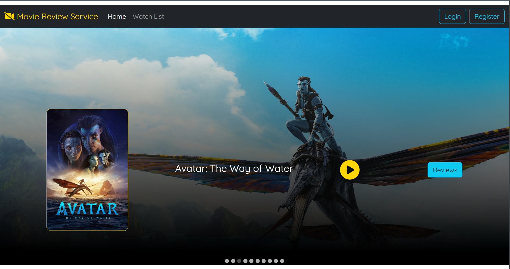
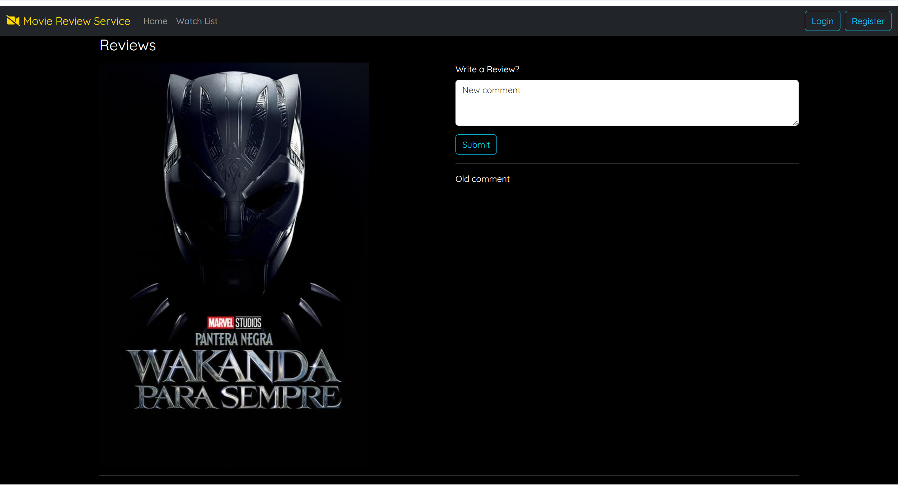

# Movie Review App

This is a movie review application built with React. It allows users to view a list of movies, watch trailers, and read/write reviews for each movie.

## Features

- Search feature to search for movies
- Create a list of movies
- Rate movies in the user's list
- Watch movie trailers
- Read reviews for each movie
- Write a review for a movie

## How to Use
0. Fire up the [server application](https://github.com/Arpan3323/movie-review-service-backend) to get the API up and running.
1. Clone the repository to your local machine.
2. Navigate to the project directory.
3. Run `npm install` to install all the dependencies.
4. Run `npm start` to start the application.
5. Open `http://localhost:3000` in your browser to view the application.

## Screenshots

### Homepage

### Reviews Page

## Contributing

Pull requests are welcome. For major changes, please open an issue first to discuss what you would like to change.

## License

[MIT](https://choosealicense.com/licenses/mit/)
